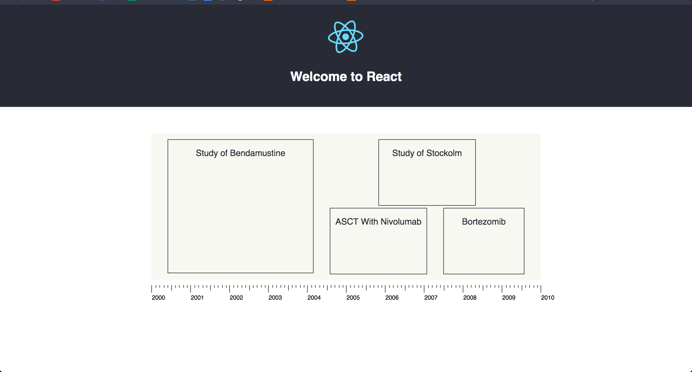
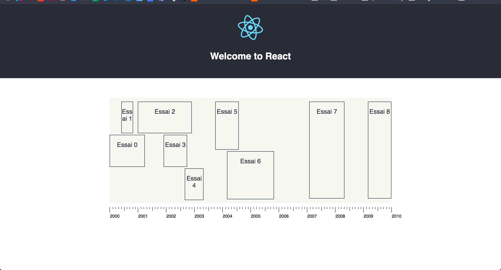

# Clinique Trial

This is a React App that displays blocs of time on a linear axis.

Blocs of time respect these 3 rules:

1. Blocs of time cannot collide
2. If two blocs of time, they have to be the same height.
3. Blocs should use all vertical space when they can, but rule #2 has precedence over this rule

Two blocs collisions

Three blocs collisions
